# 🏗️ System Architecture

This document provides a comprehensive overview of the Private AI Agent architecture, explaining how the system maintains privacy while delivering intelligent responses.

## 📋 Table of Contents

- [High-Level Overview](#high-level-overview)
- [System Components](#system-components)
- [Data Flow](#data-flow)
- [Privacy Architecture](#privacy-architecture)
- [Communication Patterns](#communication-patterns)
- [Ollama-Only Mode](#ollama-only-mode)
- [State Management](#state-management)
- [Security Model](#security-model)

## 🎯 High-Level Overview

The system consists of two main applications communicating via the atPlatform:

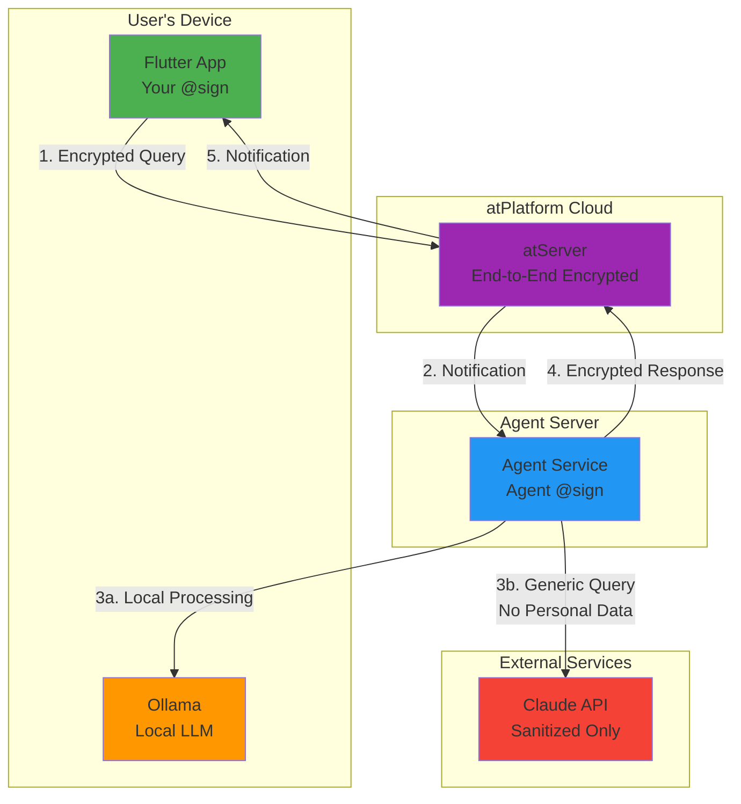

### Key Design Principles

1. **Privacy by Default**: All personal data stays local or encrypted
2. **Hybrid Intelligence**: Combines local and cloud LLMs strategically
3. **End-to-End Encryption**: atPlatform ensures data security
4. **Transparent Processing**: Users see exactly how queries are handled
5. **User Control**: Ollama-only mode for 100% local processing

## 🔧 System Components

### 1. Flutter Application (`app/`)

The cross-platform user interface built with Flutter.

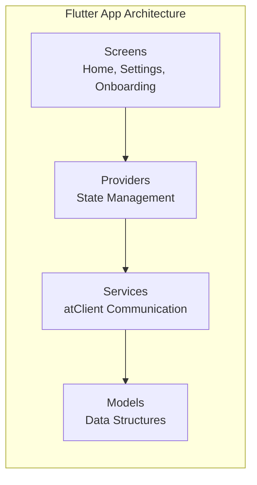

**Key Components:**

- **Screens**:
  - `OnboardingScreen`: PKAM authentication with keychain support
  - `HomeScreen`: Chat interface with message history
  - `SettingsScreen`: Privacy controls and configuration
  - `ContextManagementScreen`: User context/memory management

- **Providers** (State Management):
  - `AuthProvider`: Authentication state and keychain operations
  - `AgentProvider`: Message handling, Ollama-only mode, API communication

- **Services**:
  - `AtClientService`: Manages atPlatform connection and notifications
  - Handles encrypted message sending/receiving

- **Models**:
  - `Message`: Chat message structure
  - `AgentResponse`: Typed responses from agent

### 2. Agent Service (`agent/`)

The Dart backend that processes queries intelligently.

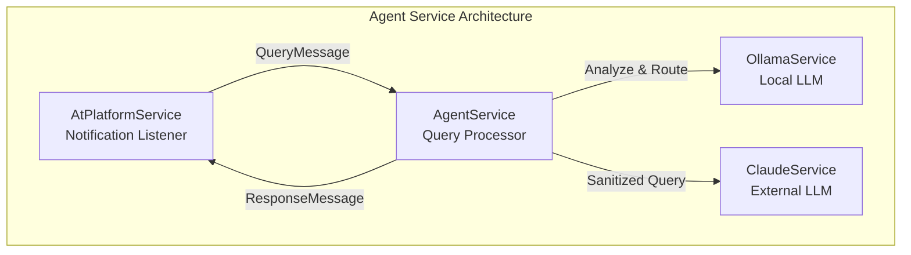

**Key Components:**

- **AtPlatformService**:
  - Listens for encrypted notifications from users
  - Auto-decrypts using at_talk_gui pattern
  - Parses QueryMessage with privacy settings
  - Sends ResponseMessage back to users

- **AgentService** (Core Logic):
  - Analyzes queries for local vs external processing
  - Determines confidence level for local answers
  - Sanitizes queries before external API calls
  - Combines local + external knowledge intelligently
  - Respects Ollama-only mode flag

- **OllamaService**:
  - Interfaces with local Ollama instance
  - Handles all personal/private queries
  - Provides context-aware responses
  - Free and unlimited usage

- **ClaudeService**:
  - Interfaces with Claude API (optional)
  - Only receives sanitized, generic queries
  - Provides external knowledge and current information
  - Usage minimized through smart routing

## 🔄 Data Flow

### Complete Query Processing Flow

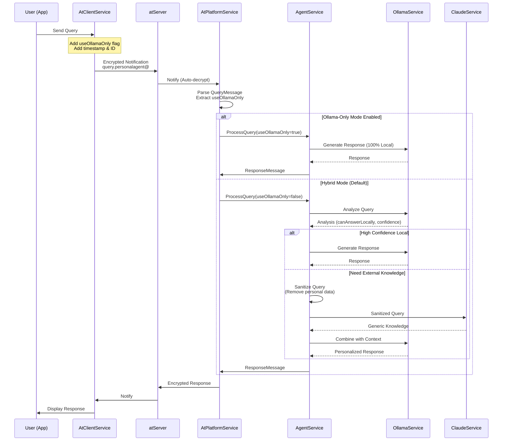

### Message Structure

**QueryMessage** (App → Agent):
```dart
{
  "id": "1760497926402",
  "type": "query",
  "content": "Should I take this job offer?",
  "userId": "@alice",
  "useOllamaOnly": false,  // Privacy flag
  "timestamp": "2025-10-14T20:12:06.588Z"
}
```

**ResponseMessage** (Agent → App):
```dart
{
  "id": "1760497926402",
  "type": "response",
  "content": "Based on your current situation...",
  "metadata": {
    "processingMode": "hybrid",
    "usedOllama": true,
    "usedClaude": false,
    "confidence": 0.85
  },
  "timestamp": "2025-10-14T20:12:08.123Z"
}
```

## 🔐 Privacy Architecture

### Three-Tier Privacy Model


### Data Classification

| Data Type | Location | Encryption | External Access |
|-----------|----------|------------|-----------------|
| User Context/Memory | atServer | E2E Encrypted | Never |
| Chat History | Local Device | Encrypted | Never |
| Query Content | Processed Locally | Encrypted in Transit | Sanitized Only |
| Personal Information | Local/Encrypted | E2E Encrypted | Never |
| Generic Queries | Processed Hybrid | None Needed | Sanitized Only |
| Responses | atServer + Local | E2E Encrypted | Never |

### Query Sanitization Process

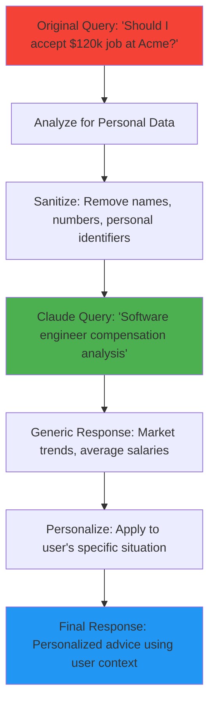

## 📡 Communication Patterns

### atPlatform Notification Pattern

Following the `at_talk_gui` pattern for automatic decryption:

```dart
// Sender (App)
await notificationService.notify(
  NotificationParams.forUpdate(
    atKey,
    value: jsonEncode(queryData),
  ),
  checkForFinalDeliveryStatus: false,
  waitForFinalDeliveryStatus: false,
);

// Receiver (Agent)
notificationService.subscribe(
  regex: 'query.*',
  namespace: 'personalagent',
  shouldDecrypt: true,  // Auto-decrypt!
);
```

### Notification Flow

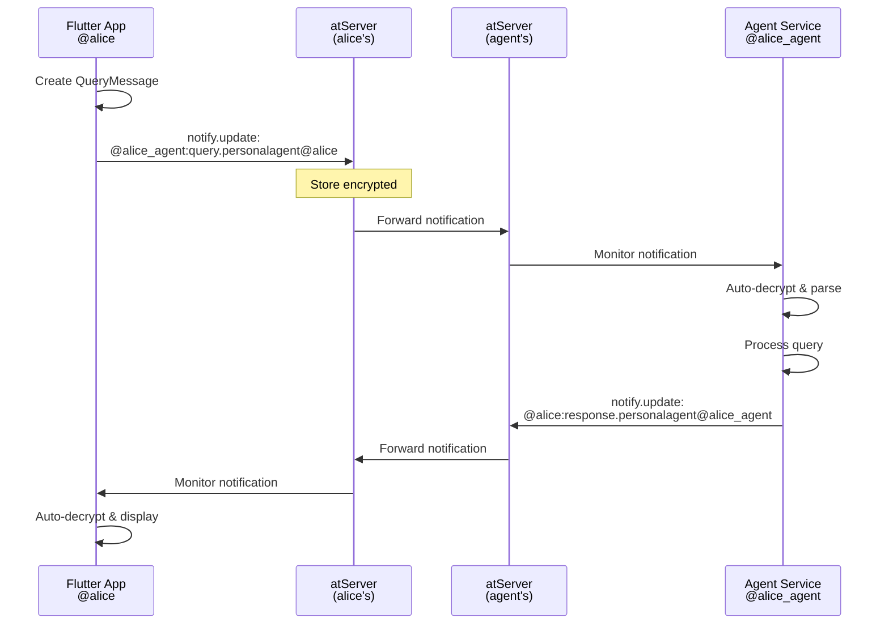

### Authentication Flow (PKAM)

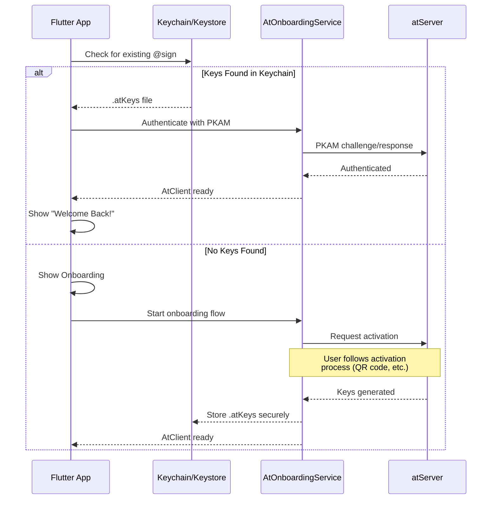

## 🔒 Ollama-Only Mode

A user-controlled privacy feature that ensures 100% local processing.

### Architecture

```mermaid
graph TB
    subgraph "Settings UI"
        SW[Toggle Switch<br/>"Use Ollama Only"]
    end
    
    subgraph "State Management"
        AP[AgentProvider]
        SP[SharedPreferences]
    end
    
    subgraph "Communication"
        AC[AtClientService]
        JSON[QueryMessage JSON]
    end
    
    subgraph "Agent Processing"
        PS[AtPlatformService]
        AS[AgentService]
        OL[OllamaService]
    end
    
    SW --> AP
    AP --> SP
    AP --> AC
    AC --> JSON
    JSON --> PS
    PS --> AS
    AS --> OL
    
    style SW fill:#4CAF50
    style OL fill:#2196F3
    style AS fill:#FF9800
```

### Implementation Details

**1. State Persistence (App)**:
```dart
// AgentProvider
bool _useOllamaOnly = false;
bool get useOllamaOnly => _useOllamaOnly;

Future<void> setUseOllamaOnly(bool value) async {
  _useOllamaOnly = value;
  final prefs = await SharedPreferences.getInstance();
  await prefs.setBool('useOllamaOnly', value);
  notifyListeners();
}
```

**2. Query Transmission**:
```dart
// AtClientService
Future<void> sendQuery(ChatMessage message, {bool useOllamaOnly = false}) async {
  final queryData = {
    'id': message.id,
    'content': message.content,
    'useOllamaOnly': useOllamaOnly,  // Include flag
    'timestamp': DateTime.now().toIso8601String(),
  };
  // Send via atPlatform...
}
```

**3. Agent Parsing**:
```dart
// AtPlatformService
final useOllamaOnly = jsonData['useOllamaOnly'] ?? false;
final query = QueryMessage(
  id: jsonData['id'],
  content: jsonData['content'],
  userId: jsonData['userId'],
  useOllamaOnly: useOllamaOnly,  // Extract from JSON
  timestamp: DateTime.parse(jsonData['timestamp']),
);
```

**4. Processing Logic**:
```dart
// AgentService
Future<ResponseMessage> processQuery(QueryMessage query) async {
  if (query.useOllamaOnly) {
    _logger.info('🔒 User requested Ollama-only mode - 100% private processing');
    return await _processWithOllama(query, context);
  }
  
  // Normal hybrid logic...
}
```

## 🎭 State Management

### Flutter App State Architecture

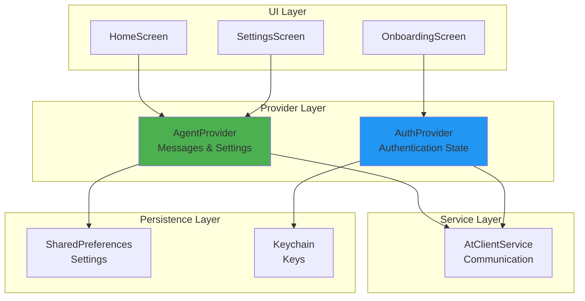

### State Flow

**AgentProvider** manages:
- Message list (query/response pairs)
- Loading states
- Ollama-only mode setting
- Error handling

**AuthProvider** manages:
- Authentication status
- Current @sign
- Onboarding completion
- Keychain operations

## 🔐 Security Model

### Encryption Layers

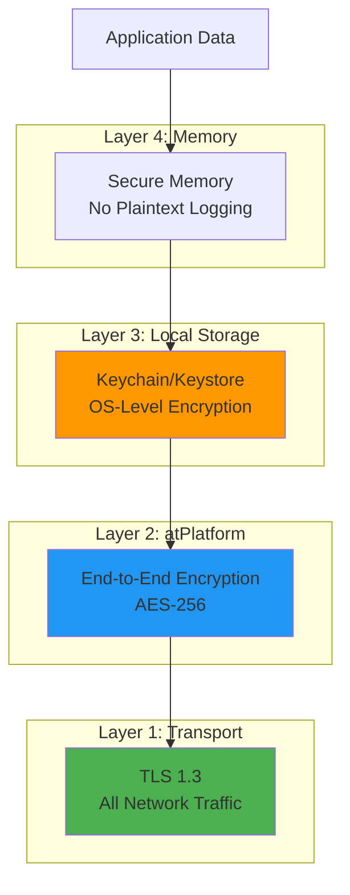

### Key Management

| Key Type | Storage | Purpose | Rotation |
|----------|---------|---------|----------|
| PKAM Private Key | Keychain/Keystore | Authentication | Never (user-owned) |
| Encryption Keys | atPlatform SDK | Message encryption | Per-message |
| API Keys (Claude) | Environment Variables | External API auth | Manual |

### Threat Model & Mitigations

| Threat | Mitigation |
|--------|-----------|
| MITM Attack | TLS + E2E encryption via atPlatform |
| Data Breach (atServer) | All data encrypted, keys never on server |
| Compromised Agent | User data still encrypted, can't decrypt |
| API Key Leakage | Only sanitized queries sent, no personal data |
| Local Device Compromise | Keychain protection, encrypted storage |
| Replay Attacks | Timestamps, unique message IDs |

## 🔍 Query Analysis Algorithm

### Decision Tree

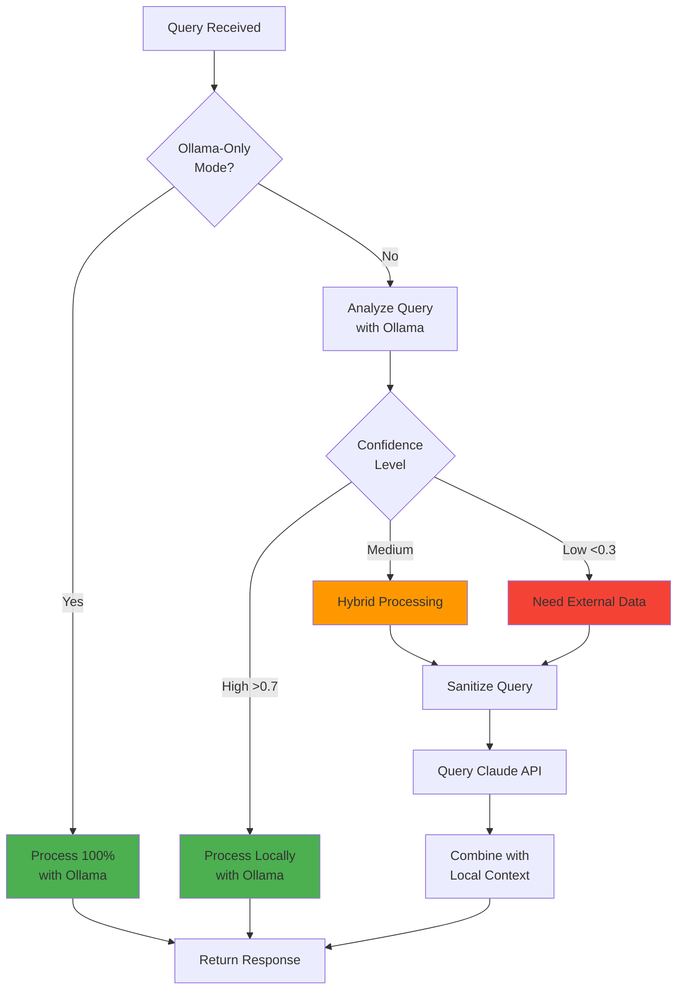

### Example Classifications

| Query Type | Confidence | Processing | External API |
|------------|-----------|------------|--------------|
| "What's my schedule today?" | High (0.95) | Local | ❌ |
| "Should I buy this stock?" | Low (0.30) | Hybrid | ✅ Sanitized |
| "Summarize my notes" | High (0.90) | Local | ❌ |
| "Latest news on AI?" | Low (0.20) | Hybrid | ✅ Generic |
| "Calculate 15% tip on $45" | High (1.00) | Local | ❌ |
| "Compare job offers" | Medium (0.60) | Hybrid | ✅ Market data |

## 📊 System Performance

### Latency Breakdown

```mermaid
gantt
    title Query Processing Time (Typical)
    dateFormat X
    axisFormat %L ms

    section Local Only
    App to atServer     :0, 100
    atServer to Agent   :100, 50
    Agent Analysis      :150, 200
    Ollama Processing   :350, 1500
    Response to User    :1850, 150
    
    section Hybrid Mode
    App to atServer     :0, 100
    atServer to Agent   :100, 50
    Agent Analysis      :150, 200
    Ollama Analysis     :350, 800
    Claude API Call     :1150, 1500
    Ollama Synthesis    :2650, 800
    Response to User    :3450, 150
```

### Resource Usage

| Component | CPU | Memory | Network | Storage |
|-----------|-----|--------|---------|---------|
| Flutter App | Low | 100-200 MB | Minimal | 10-50 MB |
| Agent Service | Low-Med | 200-400 MB | Minimal | 50-100 MB |
| Ollama | High | 4-8 GB | None | 4-7 GB (model) |
| Total | Med | 4-9 GB | <1 MB/query | 5-8 GB |

## 🚀 Deployment Architecture

### Development Setup

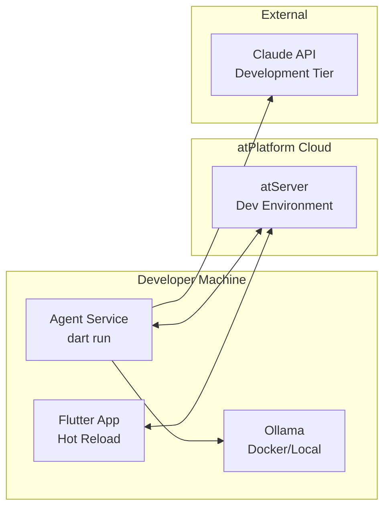

### Production Deployment

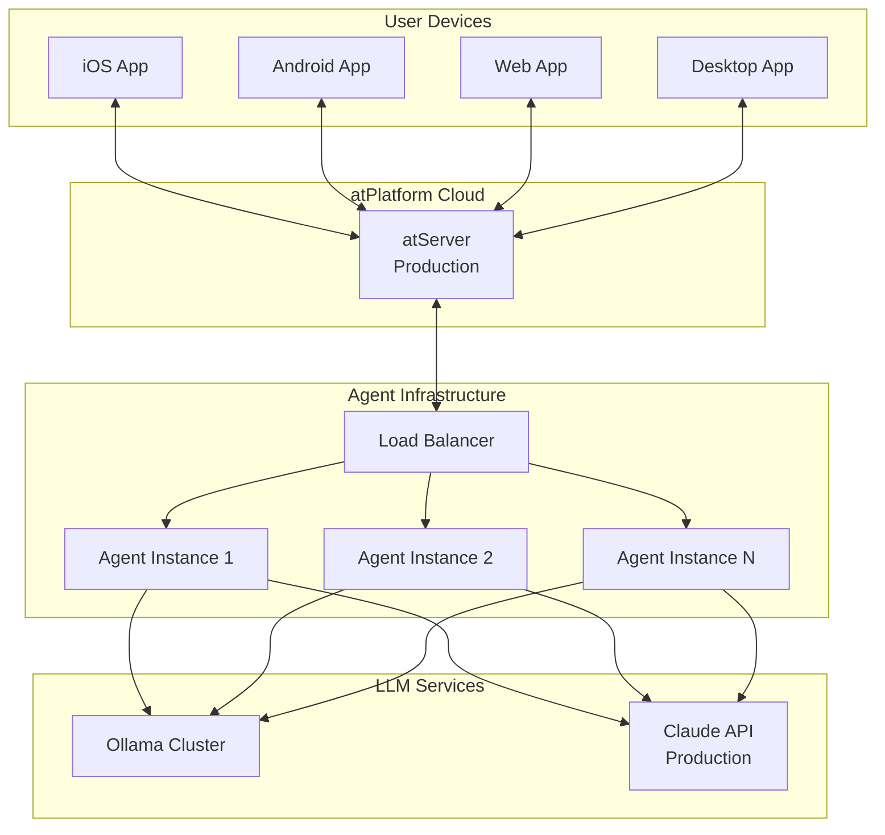

## 📈 Scalability Considerations

### Horizontal Scaling

- **Agent Service**: Stateless, can run multiple instances
- **Ollama**: Can be clustered or use GPU instances
- **atPlatform**: Handles distribution and routing

### Performance Optimization

1. **Caching**: Frequently asked generic questions
2. **Model Selection**: Different Ollama models for different query types
3. **Batch Processing**: Multiple queries from same user
4. **Connection Pooling**: Reuse atPlatform connections

## 🔄 Future Architecture Enhancements

### Planned Improvements

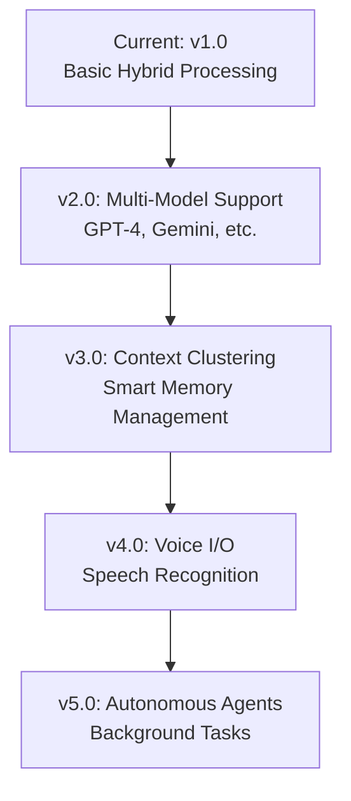

### Extension Points

- **Plugin System**: Third-party integrations
- **Custom Models**: User-provided Ollama models
- **Context Adapters**: Different storage backends
- **Response Filters**: Custom sanitization rules
- **Analytics**: Privacy-preserving usage insights

---

## 📚 Related Documentation

- [README.md](README.md) - Getting started and overview
- [ATSIGN_ARCHITECTURE.md](ATSIGN_ARCHITECTURE.md) - atPlatform integration details
- [OLLAMA_ONLY_MODE.md](OLLAMA_ONLY_MODE.md) - Privacy feature documentation
- [agent/README.md](agent/README.md) - Agent service details
- [app/README.md](app/README.md) - Flutter app details

---

**Architecture Version**: 1.0  
**Last Updated**: October 14, 2025  
**Maintainer**: [@cconstab](https://github.com/cconstab)
