# 🏗️ System Architecture

This document provides a comprehensive overview of the Private AI Agent architecture, explaining how the system maintains privacy while delivering intelligent responses.

## 📋 Table of Contents

- [High-Level Overview](#high-level-overview)
- [System Components](#system-components)
- [Data Flow](#data-flow)
- [Privacy Architecture](#privacy-architecture)
- [Communication Patterns](#communication-patterns)
- [Streaming Architecture](#streaming-architecture) ⭐ Updated!
- [Query ID Tracking](#query-id-tracking) ⭐ New!
- [Ollama-Only Mode](#ollama-only-mode)
- [State Management](#state-management)
- [Security Model](#security-model)

## 🎯 High-Level Overview

The system consists of two main applications communicating via the atPlatform:

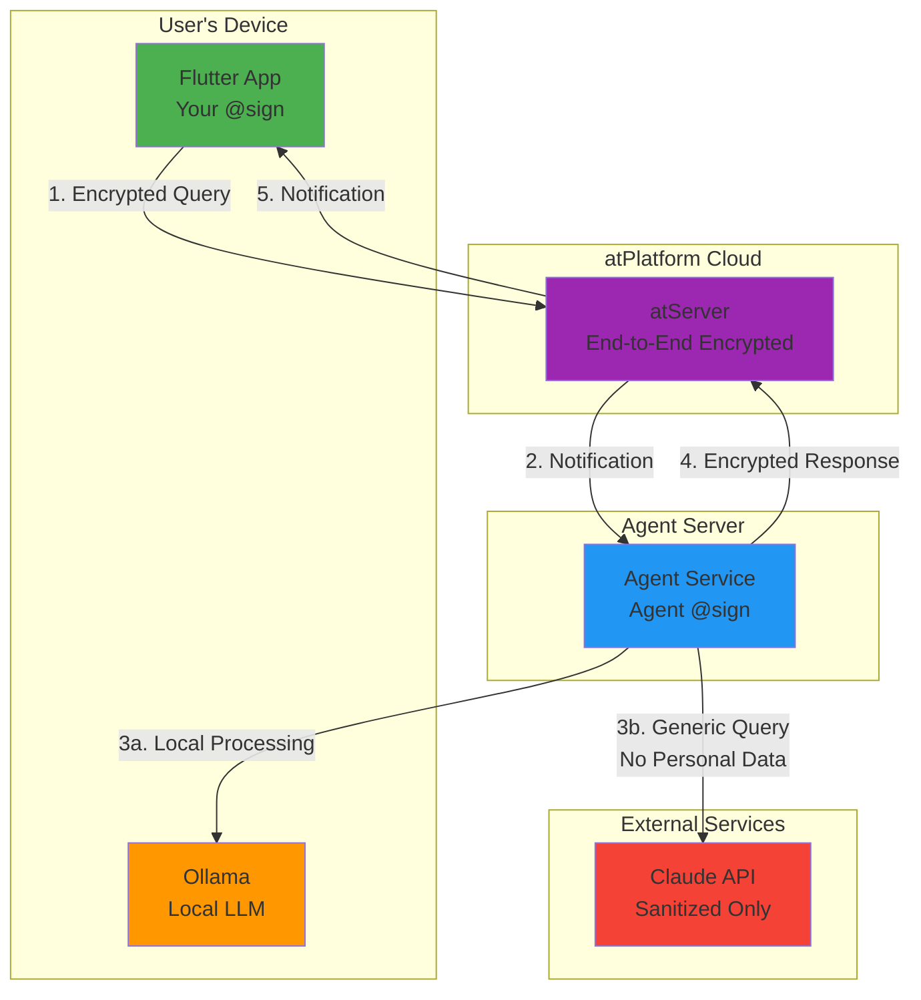
```mermaid
flowchart TB
    subgraph Device["User's Device"]
        A["Flutter App<br/>Your @sign"]
        O["Ollama<br/>Local LLM"]
    end
    
    subgraph Cloud["atPlatform Cloud"]
        AP["atServer<br/>End-to-End Encrypted"]
    end
    
    subgraph Server["Agent Server"]
        B["Agent Service<br/>Agent @sign"]
    end
    
    subgraph External["External Services"]
        C["Claude API<br/>Sanitized Only"]
    end
    
    A -->|1. Encrypted Query| AP
    AP -->|2. Notification| B
    B -->|3a. Local Processing| O
    B -->|3b. Generic Query<br/>No Personal Data| C
    B -->|4. Encrypted Response| AP
    AP -->|5. Notification| A
    
    style A fill:#4CAF50
    style B fill:#2196F3
    style O fill:#FF9800
    style C fill:#F44336
    style AP fill:#9C27B0
```

### Key Design Principles

1. **Privacy by Default**: All personal data stays local or encrypted
2. **Hybrid Intelligence**: Combines local and cloud LLMs strategically
3. **End-to-End Encryption**: atPlatform ensures data security
4. **Transparent Processing**: Users see exactly how queries are handled
5. **User Control**: Ollama-only mode for 100% local processing

## 🔧 System Components

### 1. Flutter Application (`app/`)

The cross-platform user interface built with Flutter.

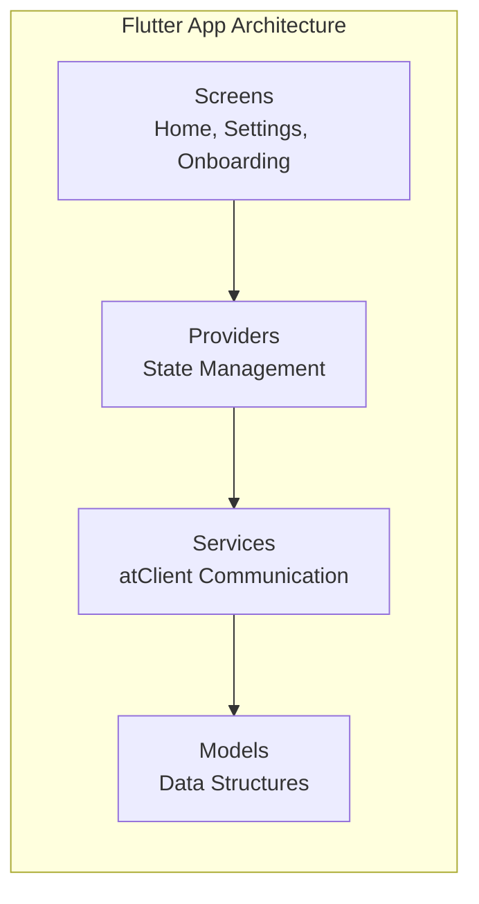
```mermaid
flowchart LR
    subgraph App["Flutter App Architecture"]
        UI["Screens<br/>Home, Settings, Onboarding"]
        PM["Providers<br/>State Management"]
        SV["Services<br/>atClient Communication"]
        MD["Models<br/>Data Structures"]
        
        UI --> PM
        PM --> SV
        SV --> MD
    end
```

**Key Components:**

- **Screens**:
  - `OnboardingScreen`: PKAM authentication with keychain support
  - `HomeScreen`: Chat interface with message history
  - `SettingsScreen`: Privacy controls and configuration
  - `ContextManagementScreen`: User context/memory management

- **Providers** (State Management):
  - `AuthProvider`: Authentication state and keychain operations
  - `AgentProvider`: Message handling, Ollama-only mode, API communication

- **Services**:
  - `AtClientService`: Manages atPlatform connection and notifications
  - Handles encrypted message sending/receiving

- **Models**:
  - `Message`: Chat message structure
  - `AgentResponse`: Typed responses from agent

### 2. Agent Service (`agent/`)

The Dart backend that processes queries intelligently.

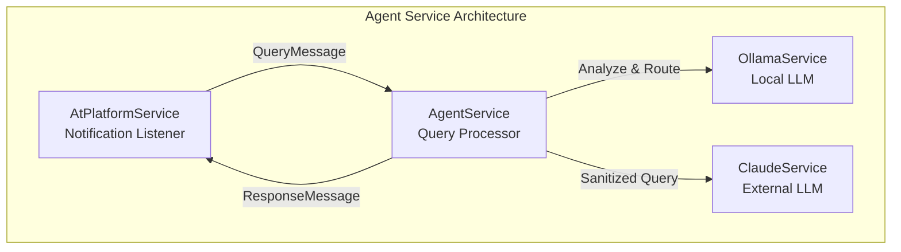
```mermaid
flowchart TB
    subgraph Agent["Agent Service Architecture"]
        AP["AtPlatformService<br/>Notification Listener"]
        AS["AgentService<br/>Query Processor"]
        OS["OllamaService<br/>Local LLM"]
        CS["ClaudeService<br/>External LLM"]
        
        AP -->|QueryMessage| AS
        AS -->|Analyze & Route| OS
        AS -->|Sanitized Query| CS
        AS -->|ResponseMessage| AP
    end
```

**Key Components:**

- **AtPlatformService**:
  - Listens for encrypted notifications from users
  - Auto-decrypts using at_talk_gui pattern
  - Parses QueryMessage with privacy settings
  - Sends ResponseMessage back to users

- **AgentService** (Core Logic):
  - Analyzes queries for local vs external processing
  - Determines confidence level for local answers
  - Sanitizes queries before external API calls
  - Combines local + external knowledge intelligently
  - Respects Ollama-only mode flag

- **OllamaService**:
  - Interfaces with local Ollama instance
  - Handles all personal/private queries
  - Provides context-aware responses
  - Free and unlimited usage

- **ClaudeService**:
  - Interfaces with Claude API (optional)
  - Only receives sanitized, generic queries
  - Provides external knowledge and current information
  - Usage minimized through smart routing

## 🔄 Data Flow

### Complete Query Processing Flow

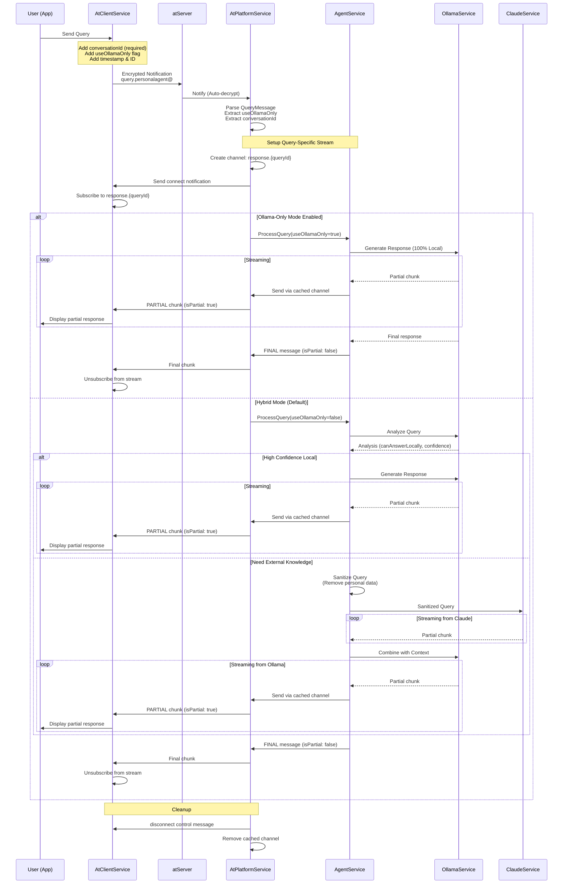
```mermaid
sequenceDiagram
    participant U as User (App)
    participant AC as AtClientService
    participant AS as atServer
    participant AP as AtPlatformService
    participant AG as AgentService
    participant OL as OllamaService
    participant CL as ClaudeService

    U->>AC: Send Query
    Note over AC: Add conversationId (required)<br/>Add useOllamaOnly flag<br/>Add timestamp & ID
    AC->>AS: Encrypted Notification<br/>query.personalagent@
    AS->>AP: Notify (Auto-decrypt)
    AP->>AP: Parse QueryMessage<br/>Extract useOllamaOnly<br/>Extract conversationId
    
    Note over AP,AG: Setup Query-Specific Stream
    AP->>AP: Create channel: response.{queryId}
    AP->>AC: Send connect notification
    AC->>AC: Subscribe to response.{queryId}
    
    alt Ollama-Only Mode Enabled
        AP->>AG: ProcessQuery(useOllamaOnly=true)
        AG->>OL: Generate Response (100% Local)
        loop Streaming
            OL-->>AG: Partial chunk
            AG->>AP: Send via cached channel
            AP->>AC: PARTIAL chunk (isPartial: true)
            AC->>U: Display partial response
        end
        OL-->>AG: Final response
        AG->>AP: FINAL message (isPartial: false)
        AP->>AC: Final chunk
        AC->>AC: Unsubscribe from stream
    else Hybrid Mode (Default)
        AP->>AG: ProcessQuery(useOllamaOnly=false)
        AG->>OL: Analyze Query
        OL-->>AG: Analysis (canAnswerLocally, confidence)
        
        alt High Confidence Local
            AG->>OL: Generate Response
            loop Streaming
                OL-->>AG: Partial chunk
                AG->>AP: Send via cached channel
                AP->>AC: PARTIAL chunk (isPartial: true)
                AC->>U: Display partial response
            end
        else Need External Knowledge
            AG->>AG: Sanitize Query<br/>(Remove personal data)
            AG->>CL: Sanitized Query
            loop Streaming from Claude
                CL-->>AG: Partial chunk
            end
            AG->>OL: Combine with Context
            loop Streaming from Ollama
                OL-->>AG: Partial chunk
                AG->>AP: Send via cached channel
                AP->>AC: PARTIAL chunk (isPartial: true)
                AC->>U: Display partial response
            end
        end
        AG->>AP: FINAL message (isPartial: false)
        AP->>AC: Final chunk
        AC->>AC: Unsubscribe from stream
    end
    
    Note over AP,AC: Cleanup
    AP->>AC: disconnect control message
    AP->>AP: Remove cached channel
```

### Message Structure

**QueryMessage** (App → Agent):
```dart
{
  "id": "1760497926402",
  "type": "query",
  "content": "Should I take this job offer?",
  "userId": "@alice",
  "conversationId": "conv_abc123",  // REQUIRED for routing
  "useOllamaOnly": false,  // Privacy flag
  "conversationHistory": [...],  // Recent messages for context
  "timestamp": "2025-10-27T20:12:06.588Z"
}
```

**ResponseMessage** (Agent → App):
```dart
{
  "id": "1760497926402",
  "content": "Based on your current situation...",
  "source": "ollama",  // or "hybrid"
  "wasPrivacyFiltered": false,
  "confidenceScore": 0.85,
  "agentName": "tarial1",
  "model": "llama3.1:8b",
  "conversationId": "conv_abc123",  // Echo back for routing
  "isPartial": false,  // true for streaming chunks
  "chunkIndex": 0,  // For ordering partial chunks
  "timestamp": "2025-10-27T20:12:08.123Z"
}
```

**Control Messages**:
```dart
// Disconnect signal (agent → app)
{
  "control": "disconnect"
}
```

## 🔐 Privacy Architecture

### Three-Tier Privacy Model

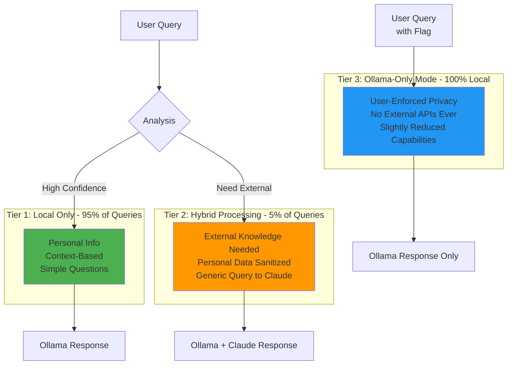
```mermaid
flowchart TD
    subgraph Tier1["Tier 1: Local Only - 95% of Queries"]
        T1["Personal Info<br/>Context-Based<br/>Simple Questions"]
    end
    
    subgraph Tier2["Tier 2: Hybrid Processing - 5% of Queries"]
        T2["External Knowledge Needed<br/>Personal Data Sanitized<br/>Generic Query to Claude"]
    end
    
    subgraph Tier3["Tier 3: Ollama-Only Mode - 100% Local"]
        T3["User-Enforced Privacy<br/>No External APIs Ever<br/>Slightly Reduced Capabilities"]
    end
    
    Q[User Query] --> D{Analysis}
    D -->|High Confidence| T1
    D -->|Need External| T2
    Q2["User Query<br/>with Flag"] --> T3
    
    T1 --> R1[Ollama Response]
    T2 --> R2[Ollama + Claude Response]
    T3 --> R3[Ollama Response Only]
    
    style T1 fill:#4CAF50
    style T2 fill:#FF9800
    style T3 fill:#2196F3
```

### Data Classification

| Data Type | Location | Encryption | External Access |
|-----------|----------|------------|-----------------|
| User Context/Memory | atServer | E2E Encrypted | Never |
| Chat History | Local Device | Encrypted | Never |
| Query Content | Processed Locally | Encrypted in Transit | Sanitized Only |
| Personal Information | Local/Encrypted | E2E Encrypted | Never |
| Generic Queries | Processed Hybrid | None Needed | Sanitized Only |
| Responses | atServer + Local | E2E Encrypted | Never |

### Query Sanitization Process

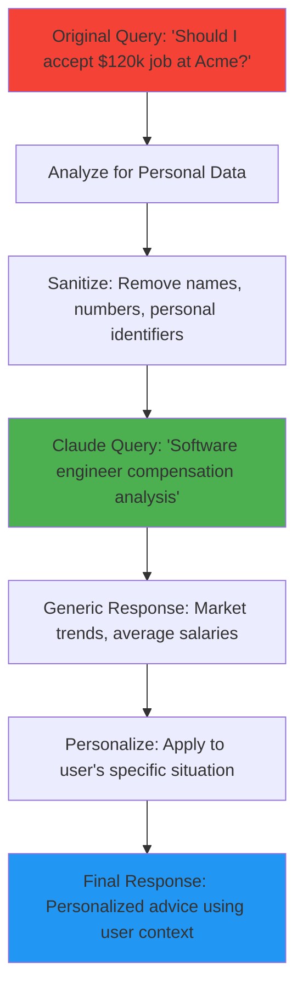
```mermaid
flowchart TD
    Q["Original Query: 'Should I accept $120k job at Acme?'"]
    
    A[Analyze for Personal Data]
    
    S["Sanitize: Remove names, numbers, personal identifiers"]
    
    C["Claude Query: 'Software engineer compensation analysis'"]
    
    R["Generic Response: Market trends, average salaries"]
    
    P["Personalize: Apply to user's specific situation"]
    
    F["Final Response: Personalized advice using user context"]
    
    Q --> A
    A --> S
    S --> C
    C --> R
    R --> P
    P --> F
    
    style Q fill:#F44336
    style C fill:#4CAF50
    style F fill:#2196F3
```

## 📡 Communication Patterns

### Modern Streaming Architecture (2025)

The system now uses **query-specific streaming channels** for efficient, scalable real-time communication:

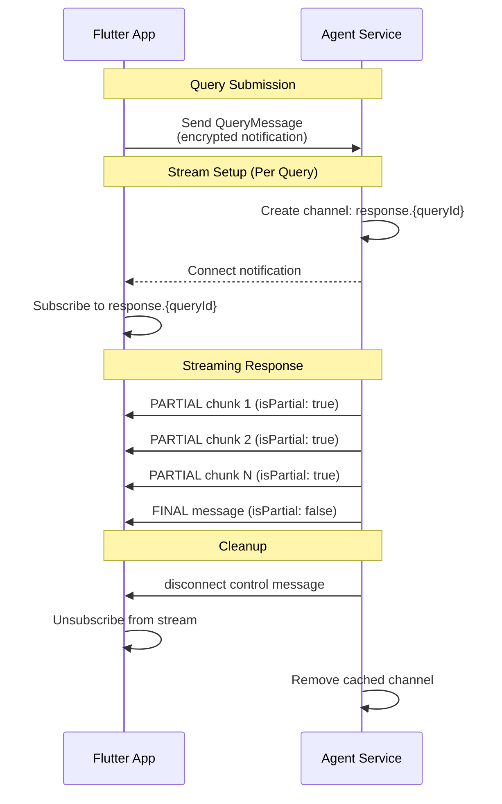
```mermaid
sequenceDiagram
    participant App as Flutter App
    participant Agent as Agent Service
    
    Note over App,Agent: Query Submission
    App->>Agent: Send QueryMessage<br/>(encrypted notification)
    
    Note over App,Agent: Stream Setup (Per Query)
    Agent->>Agent: Create channel: response.{queryId}
    Agent-->>App: Connect notification
    App->>App: Subscribe to response.{queryId}
    
    Note over App,Agent: Streaming Response
    Agent->>App: PARTIAL chunk 1 (isPartial: true)
    Agent->>App: PARTIAL chunk 2 (isPartial: true)
    Agent->>App: PARTIAL chunk N (isPartial: true)
    Agent->>App: FINAL message (isPartial: false)
    
    Note over App,Agent: Cleanup
    Agent->>App: disconnect control message
    App->>App: Unsubscribe from stream
    Agent->>Agent: Remove cached channel
```

**Key Architecture Changes:**

1. **Query-Specific Channels**: Each query gets its own channel namespace `response.{queryId}`
2. **Channel Caching**: Agent reuses the same channel for all chunks of a query (1 connection vs 20+)
3. **No Heartbeat**: Removed ping/pong system for better scalability (only on-demand traffic)
4. **Graceful Cleanup**: Explicit disconnect control messages and subscription management
5. **Network Resilience**: Timeout errors are handled gracefully without crashing

### Channel Lifecycle

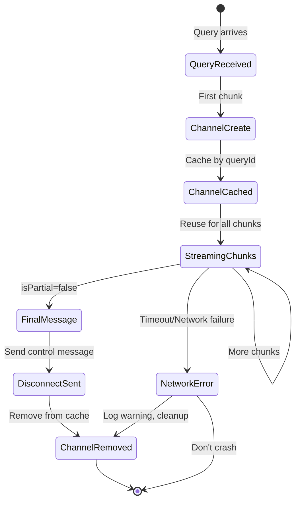
```mermaid
stateDiagram-v2
    [*] --> QueryReceived: Query arrives
    QueryReceived --> ChannelCreate: First chunk
    ChannelCreate --> ChannelCached: Cache by queryId
    ChannelCached --> StreamingChunks: Reuse for all chunks
    StreamingChunks --> StreamingChunks: More chunks
    StreamingChunks --> FinalMessage: isPartial=false
    FinalMessage --> DisconnectSent: Send control message
    DisconnectSent --> ChannelRemoved: Remove from cache
    ChannelRemoved --> [*]
    
    StreamingChunks --> NetworkError: Timeout/Network failure
    NetworkError --> ChannelRemoved: Log warning, cleanup
    NetworkError --> [*]: Don't crash
```

### Streaming Batching Strategy

Responses are batched to reduce atPlatform notification overhead:

- **Time Threshold**: Send update every **500ms**
- **Character Threshold**: OR every **50 characters**
- **Final Message**: Sent separately after streaming completes

```dart
// Agent-side batching logic
const sendIntervalMs = 500;
const minCharsBeforeSend = 50;

if (DateTime.now().difference(lastSendTime).inMilliseconds >= sendIntervalMs ||
    charsSinceLastSend >= minCharsBeforeSend) {
  await sendPartialChunk(response, isPartial: true);
}
```

## 🔍 Query ID Tracking

### Concurrent Query Management

All logs now include query IDs for tracking multiple concurrent queries:

```
[1760497926402] 📨 Query from @alice
[1760497926402] ✅ Using Ollama only (confidence: 0.95)
[1760497926402] 📤 Sending PARTIAL chunk #1 (127 chars)
[1760497926402] ✅ Streaming complete. Sent 5 batched updates
[1760497926402] ✅ Replied to @alice

[1760497926403] 📨 Query from @bob
[1760497926403] 🌐 Using HYBRID mode (Ollama + Claude) - external LLM required
[1760497926403] 🌐 Streaming response from Claude...
```

**Benefits:**
- Easy filtering: `grep "\[1760497926402\]" logs.txt`
- Track concurrent queries from multiple conversations
- Debug issues when agent is busy with multiple requests
- Clear visibility into query lifecycle

### Log Format Standards

All non-verbose logs follow the format:
```
[{queryId}] {emoji} {message}
[{queryId}]    {indented details}
```

Examples:
- `[{queryId}] 📨 Query from {userId}` - Query received
- `[{queryId}] ✅ Using Ollama only` - Decision point
- `[{queryId}] 🌐 Using HYBRID mode` - External LLM needed
- `[{queryId}] 📤 Sending PARTIAL chunk` - Streaming update
- `[{queryId}] ✅ Replied to {userId}` - Complete

## 📡 Communication Patterns (Legacy)

### atPlatform Notification Pattern

Following the `at_talk_gui` pattern for automatic decryption:

```dart
// Sender (App)
await notificationService.notify(
  NotificationParams.forUpdate(
    atKey,
    value: jsonEncode(queryData),
  ),
  checkForFinalDeliveryStatus: false,
  waitForFinalDeliveryStatus: false,
);

// Receiver (Agent)
notificationService.subscribe(
  regex: 'query.*',
  namespace: 'personalagent',
  shouldDecrypt: true,  // Auto-decrypt!
);
```

### Notification Flow

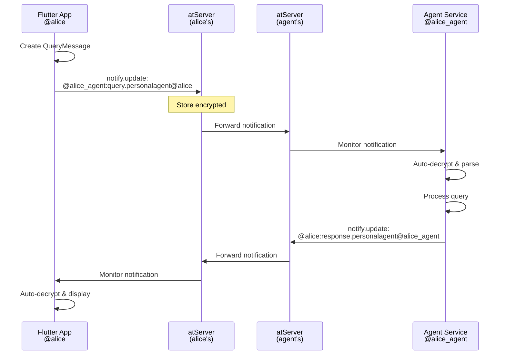
```mermaid
sequenceDiagram
    participant App as Flutter App<br/>@alice
    participant AS1 as atServer<br/>(alice's)
    participant AS2 as atServer<br/>(agent's)
    participant Agent as Agent Service<br/>@alice_agent

    App->>App: Create QueryMessage
    App->>AS1: notify.update:<br/>@alice_agent:query.personalagent@alice
    Note over AS1: Store encrypted
    AS1->>AS2: Forward notification
    AS2->>Agent: Monitor notification
    Agent->>Agent: Auto-decrypt & parse
    Agent->>Agent: Process query
    Agent->>AS2: notify.update:<br/>@alice:response.personalagent@alice_agent
    AS2->>AS1: Forward notification
    AS1->>App: Monitor notification
    App->>App: Auto-decrypt & display
```

### Authentication Flow (PKAM)

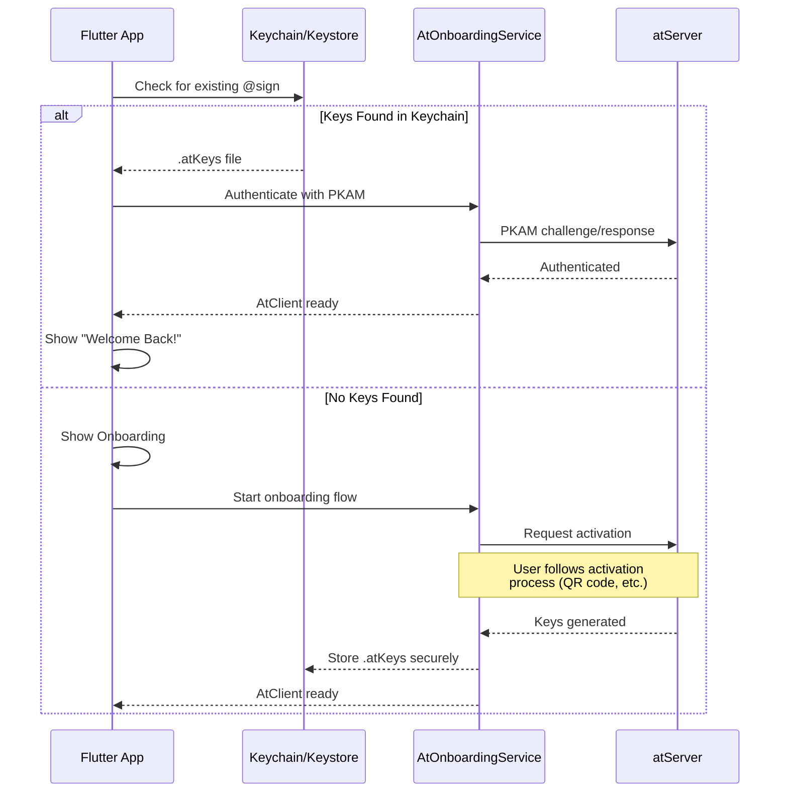
```mermaid
sequenceDiagram
    participant App as Flutter App
    participant KC as Keychain/Keystore
    participant OS as AtOnboardingService
    participant AS as atServer

    App->>KC: Check for existing @sign
    
    alt Keys Found in Keychain
        KC-->>App: .atKeys file
        App->>OS: Authenticate with PKAM
        OS->>AS: PKAM challenge/response
        AS-->>OS: Authenticated
        OS-->>App: AtClient ready
        App->>App: Show "Welcome Back!"
    else No Keys Found
        App->>App: Show Onboarding
        App->>OS: Start onboarding flow
        OS->>AS: Request activation
        Note over OS,AS: User follows activation<br/>process (QR code, etc.)
        AS-->>OS: Keys generated
        OS-->>KC: Store .atKeys securely
        OS-->>App: AtClient ready
    end
```

## 🔒 Ollama-Only Mode

A user-controlled privacy feature that ensures 100% local processing.

### Architecture

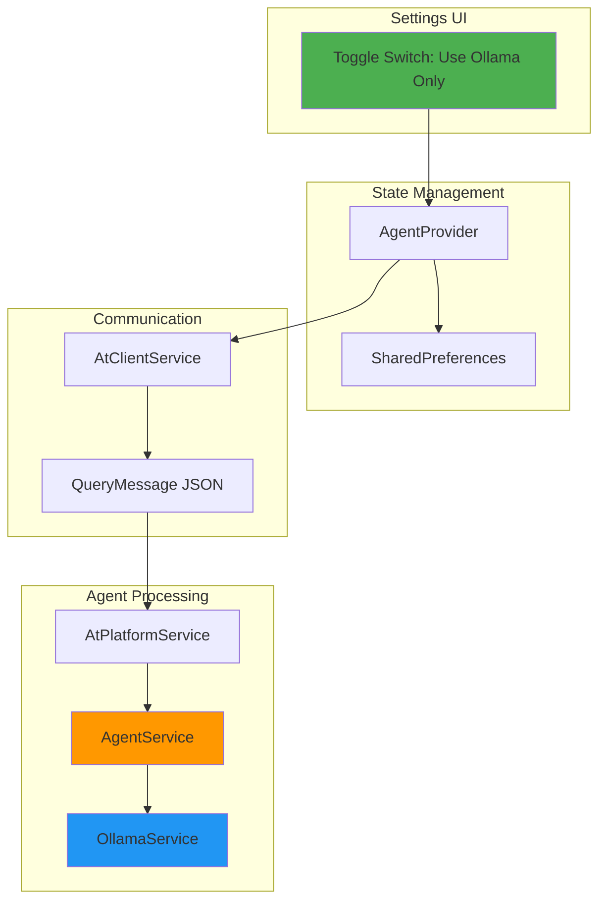
```mermaid
flowchart TB
    subgraph UI["Settings UI"]
        SW["Toggle Switch: Use Ollama Only"]
    end
    
    subgraph State["State Management"]
        AP[AgentProvider]
        SP[SharedPreferences]
    end
    
    subgraph Comm["Communication"]
        AC[AtClientService]
        JSON[QueryMessage JSON]
    end
    
    subgraph Agent["Agent Processing"]
        PS[AtPlatformService]
        AS[AgentService]
        OL[OllamaService]
    end
    
    SW --> AP
    AP --> SP
    AP --> AC
    AC --> JSON
    JSON --> PS
    PS --> AS
    AS --> OL
    
    style SW fill:#4CAF50
    style OL fill:#2196F3
    style AS fill:#FF9800
```

### Implementation Details

**1. State Persistence (App)**:
```dart
// AgentProvider
bool _useOllamaOnly = false;
bool get useOllamaOnly => _useOllamaOnly;

Future<void> setUseOllamaOnly(bool value) async {
  _useOllamaOnly = value;
  final prefs = await SharedPreferences.getInstance();
  await prefs.setBool('useOllamaOnly', value);
  notifyListeners();
}
```

**2. Query Transmission**:
```dart
// AtClientService
Future<void> sendQuery(ChatMessage message, {bool useOllamaOnly = false}) async {
  final queryData = {
    'id': message.id,
    'content': message.content,
    'useOllamaOnly': useOllamaOnly,  // Include flag
    'timestamp': DateTime.now().toIso8601String(),
  };
  // Send via atPlatform...
}
```

**3. Agent Parsing**:
```dart
// AtPlatformService
final useOllamaOnly = jsonData['useOllamaOnly'] ?? false;
final query = QueryMessage(
  id: jsonData['id'],
  content: jsonData['content'],
  userId: jsonData['userId'],
  useOllamaOnly: useOllamaOnly,  // Extract from JSON
  timestamp: DateTime.parse(jsonData['timestamp']),
);
```

**4. Processing Logic**:
```dart
// AgentService
Future<ResponseMessage> processQuery(QueryMessage query) async {
  if (query.useOllamaOnly) {
    _logger.info('🔒 User requested Ollama-only mode - 100% private processing');
    return await _processWithOllama(query, context);
  }
  
  // Normal hybrid logic...
}
```

## 🎭 State Management

### Flutter App State Architecture

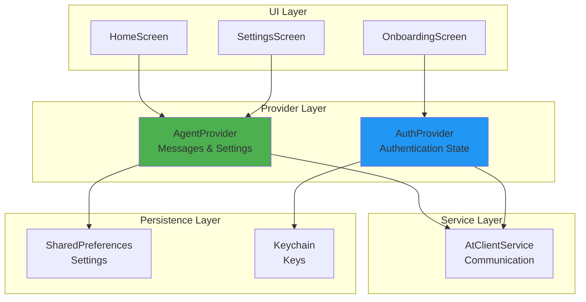
```mermaid
flowchart TB
    subgraph UI["UI Layer"]
        HS[HomeScreen]
        SS[SettingsScreen]
        OS[OnboardingScreen]
    end
    
    subgraph Provider["Provider Layer"]
        AP["AgentProvider<br/>Messages & Settings"]
        AUP["AuthProvider<br/>Authentication State"]
    end
    
    subgraph Service["Service Layer"]
        ACS["AtClientService<br/>Communication"]
    end
    
    subgraph Persist["Persistence Layer"]
        SP["SharedPreferences<br/>Settings"]
        KC["Keychain<br/>Keys"]
    end
    
    HS --> AP
    SS --> AP
    OS --> AUP
    
    AP --> ACS
    AUP --> ACS
    
    AP --> SP
    AUP --> KC
    
    style AP fill:#4CAF50
    style AUP fill:#2196F3
```

### State Flow

**AgentProvider** manages:
- Message list (query/response pairs)
- Loading states
- Ollama-only mode setting
- Error handling

**AuthProvider** manages:
- Authentication status
- Current @sign
- Onboarding completion
- Keychain operations

## �️ Error Handling & Network Resilience

### Graceful Error Handling Strategy

The system handles various failure scenarios without crashing:

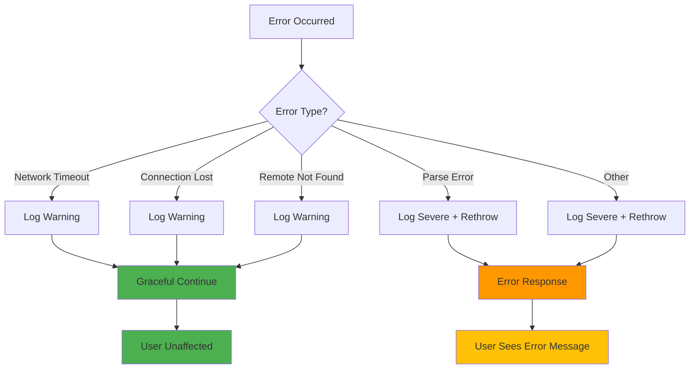
```mermaid
flowchart TD
    E[Error Occurred] --> T{Error Type?}
    
    T -->|Network Timeout| NT[Log Warning]
    T -->|Connection Lost| CL[Log Warning]
    T -->|Remote Not Found| RN[Log Warning]
    T -->|Parse Error| PE[Log Severe + Rethrow]
    T -->|Other| OT[Log Severe + Rethrow]
    
    NT --> GC[Graceful Continue]
    CL --> GC
    RN --> GC
    
    PE --> ER[Error Response]
    OT --> ER
    
    GC --> U[User Unaffected]
    ER --> EU[User Sees Error Message]
    
    style GC fill:#4CAF50
    style ER fill:#FF9800
    style U fill:#4CAF50
    style EU fill:#FFC107
```

### Network Error Detection

Network-related errors are detected by pattern matching and handled gracefully:

```dart
// Agent-side graceful handling
final errorString = e.toString().toLowerCase();
if (errorString.contains('timeout') ||
    errorString.contains('timed out') ||
    errorString.contains('network') ||
    errorString.contains('remote atsign not found') ||
    errorString.contains('full response not received')) {
  _logger.warning('[${queryId}] ⚠️ Network/timeout error - client may retry');
  // Don't rethrow - this is expected when network is down
  return;
}
```

**Recoverable Errors** (logged as warnings, don't crash):
- Network timeouts
- Connection timeouts
- Remote atSign not found
- Full response not received
- Network down/unavailable

**Critical Errors** (logged as severe, propagated):
- Parse errors (malformed JSON)
- Authentication failures
- Missing required fields (conversationId)
- Unexpected exceptions

### App-Side Timeout Management

The app manages query timeouts per-conversation:

```dart
// Cancel timeout on first response (partial or final)
_queryTimeouts[queryId]?.cancel();
_queryTimeouts.remove(queryId);

// Timeout duration
const queryTimeout = Duration(seconds: 30);
```

**Timeout Behavior:**
- Started when query is sent
- Cancelled on **first response** (partial or final)
- If timeout expires: Display error to user
- Per-query basis (not global)

### Subscription Cleanup

Query-specific subscriptions are tracked and cleaned up:

```dart
// App-side subscription management
final subscription = channel.stream.listen((response) {
  if (!response.isPartial) {
    // Final message received - cleanup
    _querySubscriptions[queryId]?.cancel();
    _querySubscriptions.remove(queryId);
  }
});

// Track for manual cleanup if needed
_querySubscriptions[queryId] = subscription;
```

**Cleanup Triggers:**
- Final message received (`isPartial: false`)
- Disconnect control message
- Query timeout
- App disposal/navigation away

### Channel Cache Management

Agent maintains a channel cache with automatic cleanup:

```dart
// Cache channel for reuse
_queryChannels[queryId] = channel;

// Cleanup on final message
if (!response.isPartial) {
  await Future.delayed(Duration(milliseconds: 100));
  channel.sink.add(json.encode({'control': 'disconnect'}));
  await Future.delayed(Duration(milliseconds: 100));
  _queryChannels.remove(queryId);
}

// Cleanup on error
catch (e) {
  _queryChannels.remove(queryId);
  // Handle error...
}
```

### Error Recovery Flow

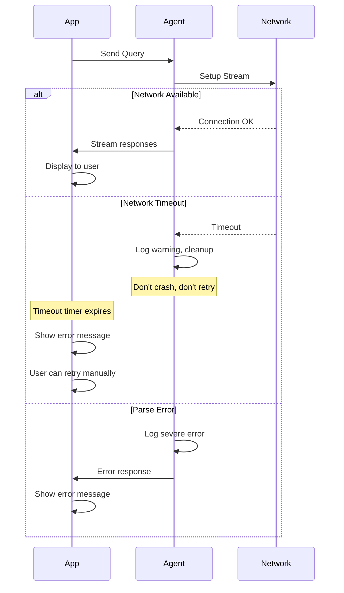
```mermaid
sequenceDiagram
    participant App
    participant Agent
    participant Network
    
    App->>Agent: Send Query
    Agent->>Network: Setup Stream
    
    alt Network Available
        Network-->>Agent: Connection OK
        Agent->>App: Stream responses
        App->>App: Display to user
    else Network Timeout
        Network-->>Agent: Timeout
        Agent->>Agent: Log warning, cleanup
        Note over Agent: Don't crash, don't retry
        Note over App: Timeout timer expires
        App->>App: Show error message
        App->>App: User can retry manually
    else Parse Error
        Agent->>Agent: Log severe error
        Agent->>App: Error response
        App->>App: Show error message
    end
```

### Logging Levels for Errors

| Level | Use Case | Example |
|-------|----------|---------|
| `.fine()` | Verbose debug info | `'🔗 Query → conversation ${conversationId}'` |
| `.info()` | Normal operations | `'[${queryId}] ✅ Streaming complete'` |
| `.warning()` | Recoverable errors | `'[${queryId}] ⚠️ Network/timeout error'` |
| `.severe()` | Critical errors | `'[${queryId}] Failed to parse query'` |
| `.shout()` | Important events | `'[${queryId}] 🌐 Using HYBRID mode'` |

## �🔐 Security Model

### Encryption Layers

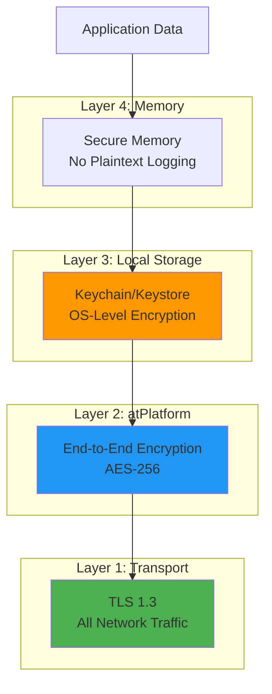
```mermaid
graph TD
    subgraph "Layer 1: Transport"
        TLS[TLS 1.3<br/>All Network Traffic]
    end
    
    subgraph "Layer 2: atPlatform"
        E2E[End-to-End Encryption<br/>AES-256]
    end
    
    subgraph "Layer 3: Local Storage"
        KS[Keychain/Keystore<br/>OS-Level Encryption]
    end
    
    subgraph "Layer 4: Memory"
        MEM[Secure Memory<br/>No Plaintext Logging]
    end
    
    APP[Application Data]
    
    APP --> MEM
    MEM --> KS
    KS --> E2E
    E2E --> TLS
    
    style TLS fill:#4CAF50
    style E2E fill:#2196F3
    style KS fill:#FF9800
```

### Key Management

| Key Type | Storage | Purpose | Rotation |
|----------|---------|---------|----------|
| PKAM Private Key | Keychain/Keystore | Authentication | Never (user-owned) |
| Encryption Keys | atPlatform SDK | Message encryption | Per-message |
| API Keys (Claude) | Environment Variables | External API auth | Manual |

### Threat Model & Mitigations

| Threat | Mitigation |
|--------|-----------|
| MITM Attack | TLS + E2E encryption via atPlatform |
| Data Breach (atServer) | All data encrypted, keys never on server |
| Compromised Agent | User data still encrypted, can't decrypt |
| API Key Leakage | Only sanitized queries sent, no personal data |
| Local Device Compromise | Keychain protection, encrypted storage |
| Replay Attacks | Timestamps, unique message IDs |
| Stream Hijacking | Query-specific namespaces, encrypted channels |
| Message Injection | Signature verification via atPlatform |
| DoS via Streams | Rate limiting, timeout management, cleanup |
| Connection Exhaustion | Channel caching (1 per query), no heartbeat |

## 🔍 Query Analysis Algorithm

### Decision Tree

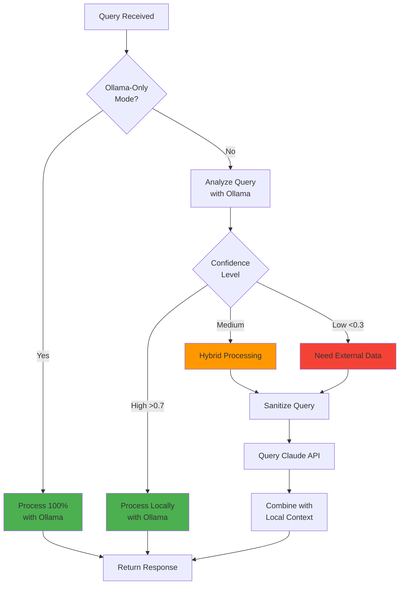
```mermaid
graph TD
    Q[Query Received] --> OM{Ollama-Only<br/>Mode?}
    
    OM -->|Yes| FULL[Process 100%<br/>with Ollama]
    OM -->|No| ANALYZE[Analyze Query<br/>with Ollama]
    
    ANALYZE --> CONF{Confidence<br/>Level}
    
    CONF -->|High >0.7| LOCAL[Process Locally<br/>with Ollama]
    CONF -->|Medium| HYBRID[Hybrid Processing]
    CONF -->|Low <0.3| EXTERNAL[Need External Data]
    
    EXTERNAL --> SANITIZE[Sanitize Query]
    SANITIZE --> CLAUDE[Query Claude API]
    CLAUDE --> COMBINE[Combine with<br/>Local Context]
    
    HYBRID --> SANITIZE
    
    LOCAL --> RESPONSE[Return Response]
    FULL --> RESPONSE
    COMBINE --> RESPONSE
    
    style FULL fill:#4CAF50
    style LOCAL fill:#4CAF50
    style HYBRID fill:#FF9800
    style EXTERNAL fill:#F44336
```

### Example Classifications

| Query Type | Confidence | Processing | External API |
|------------|-----------|------------|--------------|
| "What's my schedule today?" | High (0.95) | Local | ❌ |
| "Should I buy this stock?" | Low (0.30) | Hybrid | ✅ Sanitized |
| "Summarize my notes" | High (0.90) | Local | ❌ |
| "Latest news on AI?" | Low (0.20) | Hybrid | ✅ Generic |
| "Calculate 15% tip on $45" | High (1.00) | Local | ❌ |
| "Compare job offers" | Medium (0.60) | Hybrid | ✅ Market data |

## 📊 System Performance

### Streaming Performance Benefits

The query-specific streaming architecture provides:

1. **Reduced Connection Overhead**: 1 channel per query (vs 20+ connections previously)
2. **Lower Latency**: Partial responses appear instantly as they're generated
3. **Better UX**: Users see responses building in real-time
4. **Scalability**: No periodic heartbeat traffic (removed ping/pong)
5. **Network Resilience**: Graceful handling of timeouts without crashes

### Latency Breakdown (Streaming Mode)


```mermaid
gantt
    title Query Processing Time with Streaming (Typical)
    dateFormat X
    axisFormat %L ms

    section Setup
    App to atServer     :0, 100
    atServer to Agent   :100, 50
    Agent Analysis      :150, 200
    Stream Connection   :350, 100
    
    section Streaming (Ollama Only)
    First Chunk (450ms) :450, 0
    Chunk 2 (500ms)     :500, 0
    Chunk 3 (1000ms)    :1000, 0
    Chunk 4 (1500ms)    :1500, 0
    Final (2000ms)      :2000, 0
    
    section Streaming (Hybrid Mode)
    Analysis            :450, 800
    Claude Stream Start :1250, 0
    Claude Chunk 1      :1500, 0
    Claude Chunk 2      :2000, 0
    Claude Complete     :2500, 0
    Ollama Synthesis    :2500, 800
    Synthesis Chunk 1   :3000, 0
    Synthesis Chunk 2   :3500, 0
    Final               :4000, 0
```

**Key Metrics:**

| Metric | Ollama Only | Hybrid Mode | Notes |
|--------|-------------|-------------|-------|
| Time to First Chunk | ~450ms | ~1250ms | User sees response starting |
| Chunk Frequency | ~500ms | ~500ms | Batched updates |
| Total Time | 2-3s | 4-5s | For typical queries |
| Network Calls | 1 setup + N chunks | 1 setup + N chunks | N = 3-8 typically |
| Memory per Query | <10 MB | <20 MB | Including cached channel |

### Connection Efficiency Comparison

**Before (Fire-and-Forget per Chunk):**
```
Query 1: 20 connections (1 per chunk × 20 chunks)
Query 2: 15 connections
Query 3: 18 connections
Total: 53 connections for 3 queries
```

**After (Cached Channels):**
```
Query 1: 1 connection (reused for 20 chunks)
Query 2: 1 connection (reused for 15 chunks)
Query 3: 1 connection (reused for 18 chunks)
Total: 3 connections for 3 queries (94% reduction!)
```

### Concurrent Query Handling

The system efficiently handles multiple simultaneous queries:


```mermaid
gantt
    title Concurrent Query Processing
    dateFormat X
    axisFormat %L ms
    
    section Query A (@alice)
    Setup A         :0, 200
    Stream A        :200, 2000
    
    section Query B (@bob)
    Setup B         :500, 200
    Stream B        :700, 1800
    
    section Query C (@charlie)
    Setup C         :1000, 200
    Stream C        :1200, 2200
```

Each query maintains its own:
- Unique channel: `response.{queryId}`
- Separate subscription in app
- Independent timeout management
- Isolated error handling

### Resource Usage

| Component | CPU | Memory | Network | Storage |
|-----------|-----|--------|---------|---------|
| Flutter App | Low | 100-200 MB | <100 KB/query | 10-50 MB |
| Agent Service | Low-Med | 200-400 MB | <200 KB/query | 50-100 MB |
| Ollama | High | 4-8 GB | None | 4-7 GB (model) |
| atPlatform SDK | Low | 50-100 MB | Minimal | 10-20 MB |
| **Total** | **Med** | **4-9 GB** | **<300 KB/query** | **5-8 GB** |

**Network Traffic Breakdown:**
- Query submission: ~1-5 KB (encrypted)
- Stream setup: ~2 KB (connection handshake)
- Per chunk: ~1-10 KB (depending on content)
- Disconnect: ~0.5 KB (control message)
- **No heartbeat overhead** (removed for scalability)

## 🚀 Deployment Architecture

### Development Setup

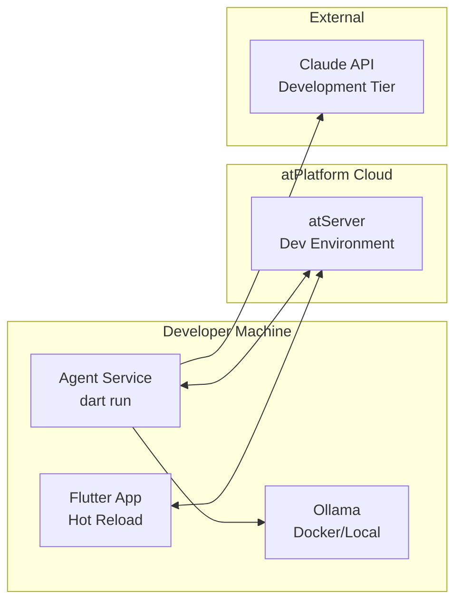
```mermaid
flowchart LR
    subgraph Dev["Developer Machine"]
        APP["Flutter App<br/>Hot Reload"]
        AGENT["Agent Service<br/>dart run"]
        OLLAMA["Ollama<br/>Docker/Local"]
    end
    
    subgraph Cloud["atPlatform Cloud"]
        ATS["atServer<br/>Dev Environment"]
    end
    
    subgraph Ext["External"]
        CLAUDE["Claude API<br/>Development Tier"]
    end
    
    APP <--> ATS
    AGENT <--> ATS
    AGENT --> OLLAMA
    AGENT --> CLAUDE
```

### Production Deployment

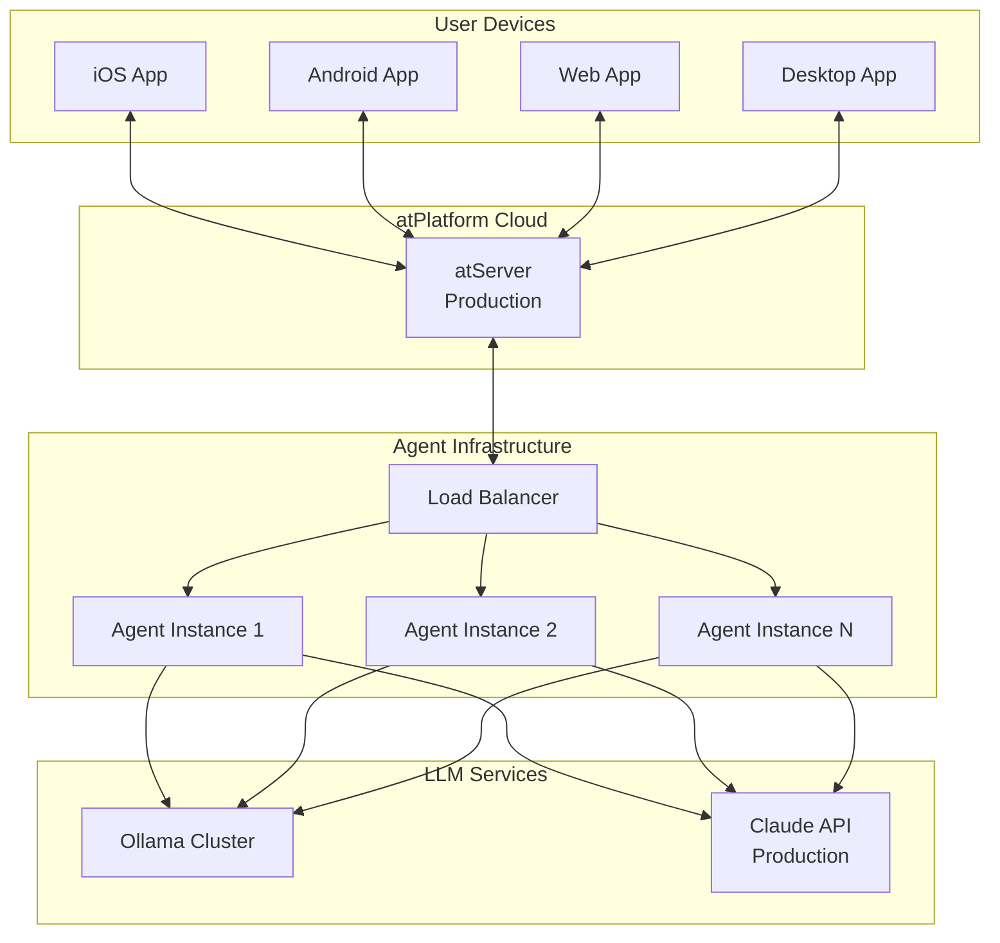
```mermaid
flowchart TB
    subgraph Users["User Devices"]
        IOS[iOS App]
        AND[Android App]
        WEB[Web App]
        DESK[Desktop App]
    end
    
    subgraph Cloud["atPlatform Cloud"]
        ATS["atServer<br/>Production"]
    end
    
    subgraph Infra["Agent Infrastructure"]
        LB[Load Balancer]
        A1[Agent Instance 1]
        A2[Agent Instance 2]
        A3[Agent Instance N]
        
        LB --> A1
        LB --> A2
        LB --> A3
    end
    
    subgraph LLM["LLM Services"]
        OLL[Ollama Cluster]
        CL[Claude API<br/>Production]
    end
    
    IOS <--> ATS
    AND <--> ATS
    WEB <--> ATS
    DESK <--> ATS
    
    ATS <--> LB
    
    A1 --> OLL
    A2 --> OLL
    A3 --> OLL
    
    A1 --> CL
    A2 --> CL
    A3 --> CL
```

## 📈 Scalability Considerations

### Horizontal Scaling

- **Agent Service**: Stateless, can run multiple instances
- **Ollama**: Can be clustered or use GPU instances
- **atPlatform**: Handles distribution and routing

### Performance Optimization

1. **Caching**: Frequently asked generic questions
2. **Model Selection**: Different Ollama models for different query types
3. **Batch Processing**: Multiple queries from same user
4. **Connection Pooling**: Reuse atPlatform connections

## 🔄 Future Architecture Enhancements

### Planned Improvements

```mermaid
graph TD
    V1[Current: v1.0<br/>Basic Hybrid Processing]
    V2[v2.0: Multi-Model Support<br/>GPT-4, Gemini, etc.]
    V3[v3.0: Context Clustering<br/>Smart Memory Management]
    V4[v4.0: Voice I/O<br/>Speech Recognition]
    V5[v5.0: Autonomous Agents<br/>Background Tasks]
    
    V1 --> V2
    V2 --> V3
    V3 --> V4
    V4 --> V5
```

### Extension Points

- **Plugin System**: Third-party integrations
- **Custom Models**: User-provided Ollama models
- **Context Adapters**: Different storage backends
- **Response Filters**: Custom sanitization rules
- **Analytics**: Privacy-preserving usage insights

---

## 📚 Related Documentation

- [README.md](README.md) - Getting started and overview
- [AT_STREAM_COMPLETE.md](AT_STREAM_COMPLETE.md) - Streaming architecture migration
- [docs/ATSIGN_ARCHITECTURE.md](docs/guides/ATSIGN_ARCHITECTURE.md) - atPlatform integration details
- [docs/OLLAMA_ONLY_MODE.md](docs/guides/OLLAMA_ONLY_MODE.md) - Privacy feature documentation
- [agent/README.md](agent/README.md) - Agent service details
- [app/README.md](app/README.md) - Flutter app details

---

**Architecture Version**: 2.0 (Streaming Architecture)  
**Last Updated**: October 27, 2025  
**Maintainer**: [@cconstab](https://github.com/cconstab)
