# 🔐 Private AI Agent with atPlatform

> **Your intelligent AI assistant that keeps your data private**

A privacy-first personal AI agent built with Flutter and Dart. Process 95% of queries locally with Ollama, use Claude only for external knowledge (with sanitization), and keep all your personal data encrypted end-to-end via atPlatform.

[](https://opensource.org/licenses/MIT)
[](https://flutter.dev)
[](https://dart.dev)
[](https://atsign.com)
[](https://ollama.ai)

**[🏗️ Architecture](ARCHITECTURE.md)** • **[🚀 Quick Start](#-quick-start)** • **[🔐 Privacy](ARCHITECTURE.md#privacy-architecture)** • **[📖 Docs](#-documentation)**

## 🌟 Key Features

- **🔒 Privacy-First**: 95% of queries processed locally with Ollama
- **🔐 End-to-End Encryption**: All data encrypted via atPlatform  
- **🧠 Hybrid Intelligence**: Local LLM + Cloud LLM (with sanitization) when needed
- **🎚️ Ollama-Only Mode**: Toggle for 100% local processing
- **📱 Cross-Platform**: Flutter app runs on macOS, iOS, Android, Linux, Windows, and Web
- **🎯 Smart Routing**: Automatically determines when external knowledge is needed
- **🛡️ Query Sanitization**: Removes personal info before any external API calls
- **✨ Transparent**: See exactly how each response was generated
- **🔑 Keychain Integration**: Seamless authentication with OS keychain

## 📐 Architecture

```mermaid
graph TB
    subgraph "Flutter App (@your_sign)"
        UI[Chat UI]
        SET[Settings]
        TOG[Ollama-Only Mode Toggle]
    end
    
    subgraph "atPlatform - End-to-End Encrypted"
        AT[atServer<br/>🔐 E2E Encryption]
    end
    
    subgraph "Agent Service (@agent_sign)"
        QR[Query Router]
        PA[Privacy Analysis]
        OL[Ollama<br/>Local LLM<br/>95% of queries]
        CL[Claude API<br/>Sanitized Only<br/>5% of queries]
        
        QR --> PA
        PA --> OL
        PA --> CL
    end
    
    UI -.->|Encrypted Query| AT
    SET -.-> AT
    TOG -.-> AT
    AT -.->|Notification| QR
    QR -.->|Encrypted Response| AT
    AT -.->|Notification| UI
    
    style UI fill:#4CAF50
    style SET fill:#4CAF50
    style TOG fill:#4CAF50
    style AT fill:#9C27B0
    style QR fill:#2196F3
    style PA fill:#2196F3
    style OL fill:#FF9800
    style CL fill:#F44336
```



📚 **[See detailed architecture with sequence diagrams →](ARCHITECTURE.md)**

## 🚀 Quick Start

### Prerequisites

- [Dart SDK](https://dart.dev/get-dart) 3.0+
- [Flutter SDK](https://flutter.dev/docs/get-started/install) 3.0+
- [Docker](https://www.docker.com/get-started) (for Ollama)
- An [@sign](https://atsign.com) (free)
- [Claude API Key](https://console.anthropic.com) (optional)

### Installation

1. Clone the repository:
```bash
git clone https://github.com/cconstab/personalagent.git
cd personalagent
```

2. Run the setup script:
```bash
chmod +x setup.sh
./setup.sh
```

3. Configure your credentials:
   - **Get 2 @signs** from [atsign.com](https://atsign.com/get-an-sign/) (free)
     - One for your agent (e.g., `@alice_agent`)
     - One for your app (e.g., `@alice`)
   - Edit `agent/.env` with your **agent's** @sign and keys path
   - Place your agent's `.atKeys` file in `agent/keys/`
   - Add Claude API key to `agent/.env` (optional, for hybrid mode)
   - Your app's @sign is set up during first launch (onboarding)
   - See [docs/guides/ATSIGN_ARCHITECTURE.md](docs/guides/ATSIGN_ARCHITECTURE.md) for details

4. Start the services:

   **Option A: Quick Start (Scripts)**
   ```bash
   # Terminal 1: Start agent
   ./run_agent.sh
   
   # Terminal 2: Start app  
   ./run_app.sh
   ```

   **Option B: Docker Compose**
   ```bash
   docker compose up
   ```

   **Option C: Manual**
   ```bash
   # Terminal 1: Start Ollama
   docker run -d -p 11434:11434 ollama/ollama
   
   # Terminal 2: Start agent
   cd agent && dart run bin/agent.dart
   
   # Terminal 3: Start app
   cd app && flutter run
   ```

## 📂 Project Structure

```
personalagent/
├── agent/                      # Dart backend service
│   ├── bin/agent.dart         # Main entry point
│   ├── lib/
│   │   ├── models/            # Data models
│   │   └── services/          # Core services
│   │       ├── agent_service.dart
│   │       ├── at_platform_service.dart
│   │       ├── ollama_service.dart
│   │       └── claude_service.dart
│   ├── pubspec.yaml
│   ├── .env.example
│   ├── Dockerfile
│   └── README.md
├── app/                        # Flutter app
│   ├── lib/
│   │   ├── main.dart
│   │   ├── models/
│   │   ├── providers/
│   │   ├── screens/
│   │   └── widgets/
│   ├── pubspec.yaml
│   └── README.md
├── docker-compose.yml
├── setup.sh
└── README.md
```

## 🔐 Privacy Model

### Three Modes of Operation

1. **🔒 Ollama-Only Mode** (100% Local)
   - User-enabled toggle in settings
   - Zero external API calls ever
   - All processing on your device or local server
   - Ideal for sensitive queries

2. **🎯 Hybrid Mode** (Default, 95% Local)
   - Intelligently routes queries
   - Local processing for personal/simple queries
   - External APIs only for current events/specialized knowledge
   - All personal data sanitized before external calls

3. **📊 What Never Leaves Your Device**
   - ✅ Your context and personal information
   - ✅ Conversation history  
   - ✅ Analysis and decision-making logic
   - ✅ Any data in Ollama-only mode

### Example: Privacy-Preserving Query

**Your Query**: "Should I accept this job offer at Acme Corp given my current salary of $120k?"

**Processing**:
1. 🧠 **Ollama analyzes**: Needs job market data
2. 🛡️ **Sanitize**: "Software engineer compensation analysis 2025"
3. ☁️ **Claude receives**: Generic market trends (no personal info)
4. 🔒 **Ollama combines**: Market data + YOUR salary + YOUR context  
5. ✅ **Response**: Personalized advice using your private data

**What Claude saw**: Generic market question  
**What Claude didn't see**: Your salary, company, personal situation

📚 **[Learn more about privacy →](ARCHITECTURE.md#privacy-architecture)**

## 🛠️ Development

### Agent Service (Dart)

```bash
cd agent

# Install dependencies
dart pub get

# Generate code
dart run build_runner build

# Run tests
dart test

# Run agent
dart run bin/agent.dart
```

See [agent/README.md](agent/README.md) for detailed documentation.

### Flutter App

```bash
cd app

# Install dependencies
flutter pub get

# Run tests
flutter test

# Run app
flutter run

# Build for production
flutter build apk  # Android
flutter build ios  # iOS
flutter build web  # Web
```

See [app/README.md](app/README.md) for detailed documentation.

## 🔧 Configuration

### Agent Configuration

Edit `agent/.env`:

```env
# atPlatform Configuration - REQUIRED
AT_SIGN=@your_agent                                    # Your agent's @sign from https://atsign.com
AT_KEYS_FILE_PATH=./keys/@your_agent_key.atKeys       # Path to your agent's .atKeys file
AT_ROOT_SERVER=root.atsign.org                         # atPlatform root server

# Authorized Users - OPTIONAL
ALLOWED_USERS=                                          # Comma-separated @signs allowed to use agent
                                                        # Example: @alice,@bob
                                                        # Leave empty to allow all @signs

# Ollama Configuration - REQUIRED
OLLAMA_HOST=http://localhost:11434                      # Ollama server URL
OLLAMA_MODEL=llama3.2                                   # Model to use (llama2, llama3.2, etc.)

# Claude API Configuration - OPTIONAL (for hybrid mode)
CLAUDE_API_KEY=your_api_key_here                        # Get from https://console.anthropic.com
CLAUDE_MODEL=claude-sonnet-4-5-20250929                 # Claude model version

# Agent Configuration - OPTIONAL
AGENT_NAME=                                             # Display name for agent (useful for multiple agents)
PRIVACY_THRESHOLD=0.7                                   # 0.0-1.0, higher = more local processing
MAX_CONTEXT_SIZE=4096                                   # Maximum context window size
```

## 📊 Performance & Cost

| Metric | Value | Notes |
|--------|-------|-------|
| **Local Processing** | ~95% of queries | Ollama handles most requests |
| **External Queries** | ~5% | Only when external knowledge needed |
| **Latency (Local)** | 1-3 seconds | Ollama processing |
| **Latency (Hybrid)** | 3-5 seconds | Includes Claude API call |
| **Cost** | Minimal | Ollama free, Claude usage ~5% |
| **Privacy Score** | 95-100% | Depending on mode |

📚 **[See detailed performance metrics →](ARCHITECTURE.md#system-performance)**

## 🤝 Contributing

Contributions are welcome! Please feel free to submit a Pull Request.

1. Fork the repository
2. Create your feature branch (`git checkout -b feature/AmazingFeature`)
3. Commit your changes (`git commit -m 'Add some AmazingFeature'`)
4. Push to the branch (`git push origin feature/AmazingFeature`)
5. Open a Pull Request

## 📝 License

This project is licensed under the MIT License - see the [LICENSE](LICENSE) file for details.

## 🙏 Acknowledgments

- [atPlatform](https://atsign.com) for end-to-end encrypted communication
- [Ollama](https://ollama.ai) for local LLM inference
- [Anthropic Claude](https://www.anthropic.com) for external knowledge
- [Flutter](https://flutter.dev) for cross-platform UI

## 🎓 Quick Reference

### Toggle Ollama-Only Mode
1. Open app settings (gear icon)
2. Enable "Use Ollama Only" toggle
3. All queries now 100% local (no external APIs)

### Check Agent Status
```bash
# View agent logs
tail -f agent/logs/agent.log

# Verify Ollama is running
curl http://localhost:11434/api/tags

# Test Claude API (optional)
curl https://api.anthropic.com/v1/messages \
  -H "x-api-key: $CLAUDE_API_KEY" \
  -H "anthropic-version: 2023-06-01"
```

### Common Issues
- **"No response from agent"** → Check agent is running: `./run_agent.sh`
- **"Ollama error"** → Verify Ollama: `curl http://localhost:11434/api/tags`
- **"Authentication failed"** → Check `.atKeys` file exists in correct location
- **"Keys not found in keychain"** → Re-run onboarding process in app

## 📞 Support

- 📖 [Full Documentation](ARCHITECTURE.md)
- 🐛 [Issue Tracker](https://github.com/cconstab/personalagent/issues)
- 💬 [Discussions](https://github.com/cconstab/personalagent/discussions)
- 📧 Email: [your-email@example.com]

## 🗺️ Roadmap

### ✅ Completed (v1.0)
- [x] Agent service with Ollama integration
- [x] Flutter cross-platform UI
- [x] Privacy-preserving hybrid query routing
- [x] atPlatform end-to-end encryption
- [x] Ollama-only mode toggle
- [x] Query sanitization
- [x] Auto-decrypting notifications
- [x] Keychain integration for seamless auth
- [x] Smart notification pattern (at_talk_gui)

### 🚧 In Progress (v1.1)
- [ ] Context management UI
- [ ] Enhanced error handling and retry logic
- [x] Response streaming for real-time feedback

### 🔮 Future (v2.0+)
- [ ] Multi-model support (GPT-4, Gemini, local models)
- [ ] Voice input/output
- [ ] Mobile app store deployment
- [ ] Background autonomous tasks
- [ ] Plugin system for extensibility
- [ ] Privacy-preserving analytics

## 📖 Documentation

### Core Documentation
- **[ARCHITECTURE.md](ARCHITECTURE.md)** - Complete system architecture with streaming details
- **[AT_STREAM_COMPLETE.md](AT_STREAM_COMPLETE.md)** - Streaming architecture implementation
- **[CONTRIBUTING.md](CONTRIBUTING.md)** - How to contribute to the project
- **[docs/TROUBLESHOOTING.md](docs/TROUBLESHOOTING.md)** - Common issues and solutions

### User Guides
- **[atPlatform Integration](docs/guides/ATSIGN_ARCHITECTURE.md)** - How we use atPlatform for E2E encryption
- **[Ollama-Only Mode](docs/guides/OLLAMA_ONLY_MODE.md)** - 100% local privacy mode feature
- **[Keychain Authentication](docs/guides/KEYCHAIN_AUTH.md)** - Seamless OS authentication flow
- **[Multiple @signs Support](docs/guides/MULTI_ATSIGN_SUPPORT.md)** - Using multiple agent instances

### Component Documentation
- **[agent/README.md](agent/README.md)** - Agent service (Dart backend)
- **[app/README.md](app/README.md)** - Flutter app (cross-platform UI)

📚 **[Browse all documentation →](docs/README.md)**

---

**Mission**: Prove that AI can be both intelligent AND private by keeping personal data local/encrypted while selectively using cloud LLMs for external knowledge only.

