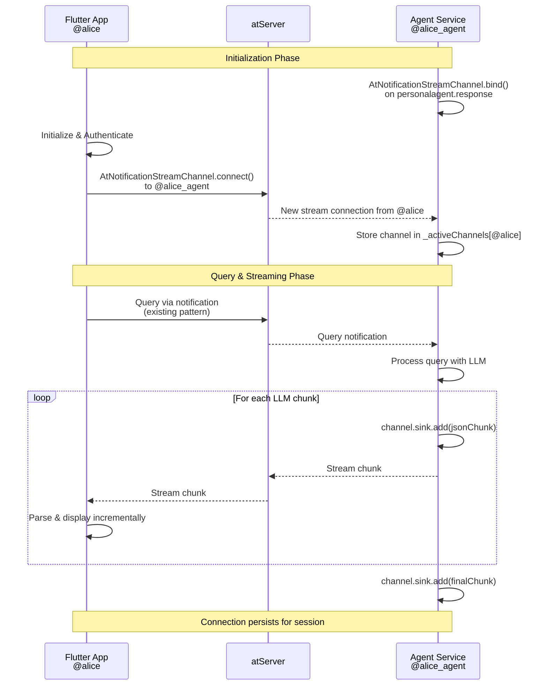
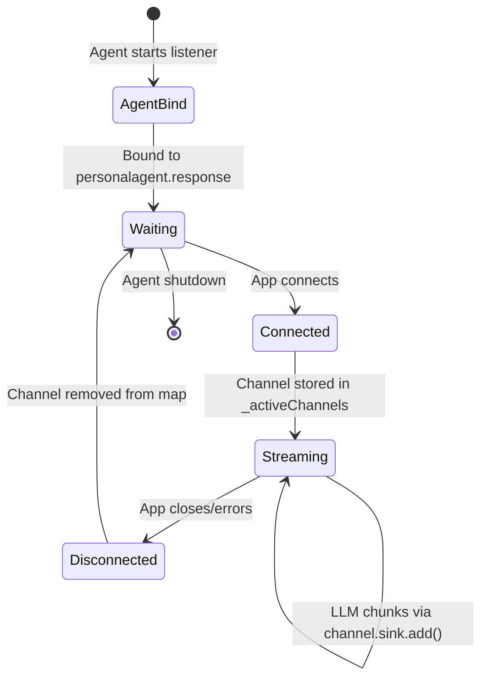

# at_stream Migration Documentation

## Overview

**Version 2.0** introduces efficient bi-directional streaming for LLM responses using the `at_stream` package, eliminating the per-chunk notification overhead of the previous architecture.

## Stream Architecture

### Sequence Diagram



## Agent Side Implementation

### Bind Pattern (Server)

The agent acts as the "server" and binds a listener for incoming stream connections:

```dart
// agent/lib/services/at_platform_service.dart

// Store active channels for each connected user
final Map<String, AtNotificationStreamChannel<String, String>> _activeChannels = {};

void startResponseStreamListener() {
  AtNotificationStreamChannel.bind<String, String>(
    _atClient!,
    baseNamespace: 'personalagent',
    domainNamespace: 'response',
    sendTransformer: const MessageSendTransformer(),
    recvTransformer: const QueryReceiveTransformer(),
  ).listen((channel) async {
    final fromAtSign = channel.otherAtsign;
    
    // Store the channel for this user
    _activeChannels[fromAtSign] = channel;
    
    // Listen for channel closure
    channel.stream.listen(
      (_) {},  // No incoming data expected on response channel
      onDone: () => _activeChannels.remove(fromAtSign),
      onError: (_) => _activeChannels.remove(fromAtSign),
    );
  });
}

// Send response via stream if available, fall back to notification
Future<void> sendStreamResponse(String recipientAtSign, ResponseMessage response) async {
  final channel = _activeChannels[recipientAtSign];
  
  if (channel != null) {
    // Send via stream - much more efficient!
    final jsonData = json.encode(response.toJson());
    channel.sink.add(jsonData);
  } else {
    // Fall back to notification-based approach
    await sendResponse(recipientAtSign, response);
  }
}
```

## App Side Implementation

### Connect Pattern (Client)

The app acts as the "client" and connects to the agent's bound listener:

```dart
// app/lib/services/at_client_service.dart

Future<void> startResponseStreamConnection() async {
  // Connect to agent's stream channel
  final channel = await AtNotificationStreamChannel.connect<String, String>(
    _atClient!,
    otherAtsign: _agentAtSign!,
    baseNamespace: 'personalagent',
    domainNamespace: 'response',
    sendTransformer: QuerySendTransformer(),
    recvTransformer: MessageReceiveTransformer(),
  );

  // Listen for incoming messages from agent
  channel.stream.listen((String responseJson) {
    // Parse JSON response
    final responseData = json.decode(responseJson) as Map<String, dynamic>;
    
    // Convert to ChatMessage
    final message = ChatMessage(
      id: responseData['id'],
      content: responseData['content'],
      isUser: false,
      isPartial: responseData['metadata']?['isPartial'] ?? false,
      chunkIndex: responseData['metadata']?['chunkIndex'] as int?,
      // ... other fields
    );

    // Emit to UI via existing controller
    _messageController.add(message);
  });
}
```

## Stream Transformers

Following the MCP (Model Context Protocol) example pattern, transformers are simplified:

```dart
// Send transformer: Pass through JSON string
class MessageSendTransformer extends StreamTransformerBase<String, String> {
  @override
  Stream<String> bind(Stream<String> stream) => stream;
}

// Receive transformer: Extract value from AtNotification tuple
class MessageReceiveTransformer 
    extends StreamTransformerBase<(AtNotification, String), String> {
  @override
  Stream<String> bind(Stream<(AtNotification, String)> stream) {
    return stream.map((tuple) => tuple.$2);  // Extract JSON string
  }
}
```

## Benefits

| Aspect | Notification-Based (Old) | at_stream-Based (New) |
|--------|-------------------------|----------------------|
| **Overhead** | One notification per chunk | Single channel per session |
| **Latency** | Higher (notification per chunk) | Lower (direct stream) |
| **Scalability** | Limited by notification rate | Better throughput |
| **Connection** | Stateless (per message) | Stateful (persistent channel) |
| **Simplicity** | Simple but inefficient | Clean and efficient |
| **Code Complexity** | Simple | Moderate (channel management) |

## Stream-Only Architecture

The system now uses **streams exclusively** for LLM response delivery:

## Stream-Only Architecture

The system now uses **streams exclusively** for LLM response delivery:

### Agent Behavior
- **`sendStreamResponse()`** sends only via stream channel
- Throws exception if no active channel exists
- Ensures app must be connected to receive responses

### App Behavior  
- **`startResponseStreamConnection()`** must succeed for app to work
- All LLM responses received exclusively via stream
- No fallback notification listeners

### Error Handling
If stream connection fails:
- Agent throws exception when trying to send
- App initialization reports error
- **Solution**: Ensure proper network connectivity and authentication

This stream-only approach:
✅ Simplifies codebase (removed dual path complexity)  
✅ Forces proper connection establishment  
✅ Makes debugging easier (single code path)  
✅ Improves performance (no fallback overhead)

## Connection Lifecycle



## Testing

The at_stream migration has been tested and confirmed working:
- ✅ Agent binds listener on startup
- ✅ App connects after authentication
- ✅ LLM response chunks stream efficiently
- ✅ Real-time display in app UI
- ✅ Fallback to notifications works when needed

## Performance Impact

With at_stream, a typical LLM response with 50 chunks now requires:
- **Old**: 50 individual notifications (50+ round trips)
- **New**: 1 channel setup + 50 stream messages (1 setup + efficient streaming)

This dramatically reduces latency and improves scalability for multiple concurrent users.
